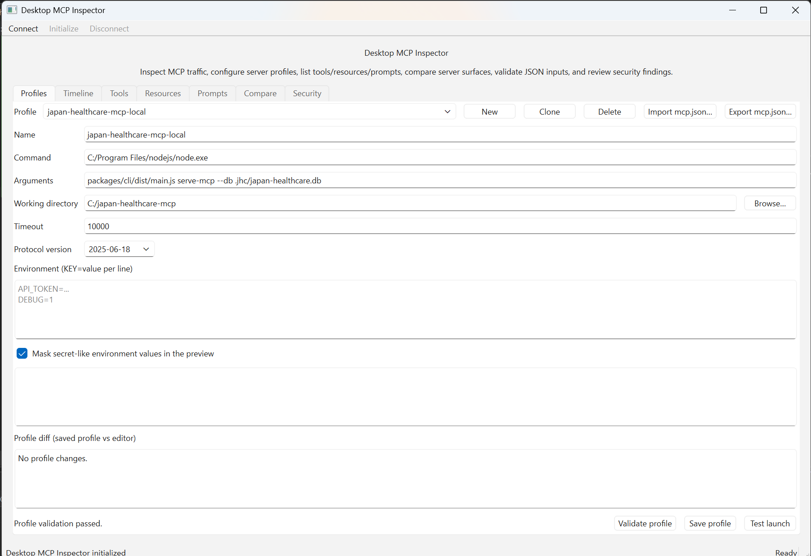

# Desktop MCP Inspector

Desktop MCP Inspector is a native C++/Qt desktop application for inspecting, debugging, and auditing Model Context Protocol (MCP) servers locally.

It is designed for developers and reviewers who want a desktop-first inspector for MCP server behavior, JSON-RPC traffic, profile configuration, and security posture.

> Status: early implementation with release packaging scaffolding
>
> Primary target: Windows 11, macOS, and Linux desktop environments

## UI preview



The screenshot above shows the main window layout of the inspector.

## What it does

Desktop MCP Inspector helps users:

- connect to local stdio MCP servers
- run MCP initialization and capability discovery
- inspect tools, resources, prompts, notifications, and raw JSON-RPC traffic
- execute tool calls with reviewable JSON input and output
- capture stderr and timeline events during inspection
- manage MCP profiles and `mcp.json` import/export flows
- flag risky commands, environment variables, endpoints, tools, schemas, and resources
- export audit reports in Markdown or HTML
- compare server capabilities, tools, resources, prompts, schemas, and diff reports
- package preview builds for Windows, macOS, and Linux releases

## Quick start

Install the required toolchain:

- C++20-capable compiler
- CMake 3.24 or later
- Qt 6.5 or later with `Core`, `Widgets`, `Sql`, and `Network`
- Ninja or another CMake-supported build tool

Then configure, build, and run tests:

```bash
cmake --preset debug
cmake --build --preset debug
ctest --preset debug
```

For platform-specific setup and troubleshooting, see [docs/development-setup.md](docs/development-setup.md).

## Sample MCP server

A minimal local stdio MCP server is included for smoke tests and demos:

```bash
python examples/mcp-servers/stdio-echo-server.py
```

Import this sample profile in the app:

```text
examples/profiles/python-stdio-echo.mcp.json
```

See [docs/sample-mcp-server.md](docs/sample-mcp-server.md) for the full connection flow and expected `echo` tool call.

## Packaging and releases

Release packaging is configured with CPack and GitHub Actions.

| Platform | Release artifact |
| --- | --- |
| Windows | NSIS installer and ZIP |
| macOS | DMG and TGZ |
| Linux | AppImage, DEB, and TGZ |

A release workflow builds packages on tag pushes matching `v*.*.*`, published GitHub Releases, and manual dispatch. See [docs/packaging.md](docs/packaging.md) for local packaging commands and release workflow details.

The v0.1.0 release checklist lives at [docs/release/v0.1.0-checklist.md](docs/release/v0.1.0-checklist.md).

## Documentation

- [Developer setup](docs/development-setup.md)
- [Sample MCP server connection](docs/sample-mcp-server.md)
- [Packaging and release guide](docs/packaging.md)
- [v0.1.0 release checklist](docs/release/v0.1.0-checklist.md)
- [README localization policy](docs/readme-localization-policy.md)
- [License audit notes](docs/license-audit.md)
- [Code style and static analysis](docs/code-style.md)
- [Roadmap](docs/roadmap.md)
- [Source layout](src/README.md)
- [Contributing guide](CONTRIBUTING.md)
- [Security policy](SECURITY.md)

## Repository layout

```text
Desktop-MCP-Inspector/
  .github/
    ISSUE_TEMPLATE/       Issue templates
    workflows/            Build/test and release workflows
  cmake/                  Shared CMake helper modules
  docs/                   Developer, release, and policy documentation
  examples/               Sample MCP servers and profiles
  scripts/                Packaging helper scripts
  src/
    app/                  Application entry point, MainWindow shell, app metadata/settings
    mcp/                  MCP protocol and JSON-RPC implementation
    transport/            stdio / HTTP transport abstractions
    timeline/             Traffic timeline models and storage
    config/               Profiles, mcp.json, validation, and diffs
    security/             Rule engine, findings, and risk scoring
    ui/                   Reusable inspector panels and widgets
  tests/                  Catch2/CTest test source root
  plan/                   Implementation plan and task status notes
```

## Technology stack

| Layer | Technology |
| --- | --- |
| Language | C++20 or later |
| UI | Qt 6 Widgets |
| Build | CMake presets |
| Test | Catch2 with CTest |
| Storage | SQLite |
| Packaging | CPack, GitHub Actions, NSIS, DragNDrop, DEB, AppImage |

## Current milestone

The project has moved through MCP core, transport, timeline, tools, profile, security, reporting, recorder, and compare scaffolding tasks. The current operations focus is v0.1.0 release readiness:

- CPack package metadata and install rules
- Windows installer workflow
- macOS DMG workflow
- Linux AppImage and DEB workflow
- automatic GitHub Release asset upload
- sample MCP server connection guide
- Issue and PR templates
- release checklist and license audit notes

See [docs/roadmap.md](docs/roadmap.md) and [plan/07_task_list.md](plan/07_task_list.md) for the task plan.

## Security posture

MCP servers can expose sensitive local capabilities such as file access, command execution, and external API access. Treat unknown MCP servers as untrusted. Prefer sandboxed directories and avoid passing production secrets during testing.

Security issues should be reported according to [SECURITY.md](SECURITY.md).

## License

Apache License 2.0. See [LICENSE](LICENSE). Dependency and release-tooling notes are tracked in [docs/license-audit.md](docs/license-audit.md).

## 日本語メモ

Desktop MCP Inspector は MCP サーバーの挙動、JSON-RPC 通信、プロファイル設定、セキュリティ上の注意点をローカルデスクトップで確認するための C++/Qt アプリです。

- セットアップは [docs/development-setup.md](docs/development-setup.md) を参照してください。
- サンプル MCP サーバー接続は [docs/sample-mcp-server.md](docs/sample-mcp-server.md) を参照してください。
- v0.1.0 の配布準備は [docs/release/v0.1.0-checklist.md](docs/release/v0.1.0-checklist.md) で管理します。
- README の英日併記方針は [docs/readme-localization-policy.md](docs/readme-localization-policy.md) にまとめています。
