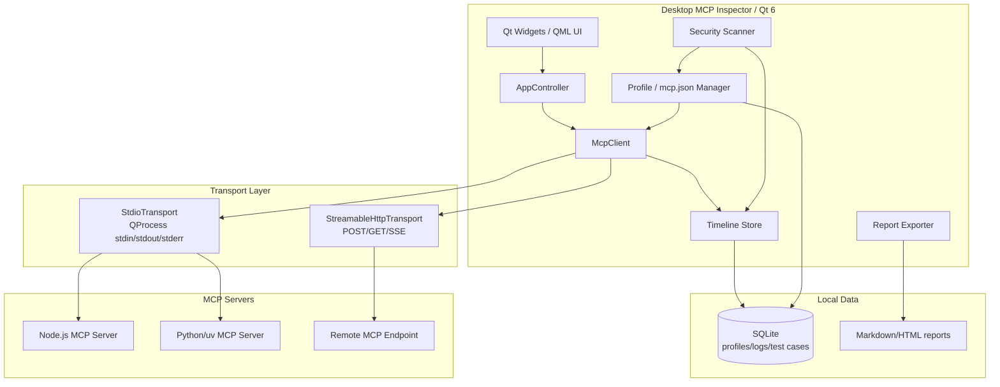

# 00. プロジェクト全体像・アーキテクチャ概要

> Desktop MCP Inspector — MCP サーバーをローカルで検査・実行・監査する C++ 製デスクトップアプリケーション
> License: Apache-2.0（候補） / Status: Planning

---

## 1. プロジェクトの目的

`Desktop MCP Inspector` は、Model Context Protocol（MCP）サーバーの接続確認、tools/resources/prompts の検査、JSON-RPC 通信の可視化、セキュリティ監査をローカルデスクトップで行うための OSS アプリケーションである。

公式の MCP Inspector は既に存在するため、本プロジェクトは単なるクローンではなく、以下の価値に集中する。

- **単体デスクトップアプリ**として配布し、Node.js/npx 前提を弱める
- **通信タイムライン**で MCP の JSON-RPC request/response/notification を完全に追跡する
- **MCP 設定ファイルの検証・編集**を GUI で支援する
- **危険な tool 定義・実行設定・環境変数**を検出する
- **監査レポート**を Markdown/HTML で出力し、企業利用・OSS レビューに使えるようにする

公式ドキュメント上の MCP Inspector は MCP サーバーの testing/debugging 用ツールであり、server connection pane、resources、prompts、tools、notifications を確認できる。Desktop MCP Inspector はこの基本領域に加え、C++ ネイティブ UI、永続ログ、設定差分、セキュリティ診断、レポート出力を主要差別化要素とする。

参考:
- https://modelcontextprotocol.io/docs/tools/inspector
- https://github.com/modelcontextprotocol/inspector
- https://modelcontextprotocol.io/specification/2025-06-18/basic/transports

---

## 2. 想定ユーザー / 利用前提

| セグメント | 主な課題 | Desktop MCP Inspector が提供する価値 |
|------------|----------|--------------------------------------|
| MCP サーバー開発者 | tool schema、レスポンス、エラーを手早く確認したい | tools/list、tools/call、raw JSON、再実行 |
| AI アプリ開発者 | 複数 MCP サーバーの挙動が見えない | 通信タイムライン、サーバー比較、履歴検索 |
| OSS メンテナ | README やリリース前の動作確認を効率化したい | デモ用プロファイル、テストケース保存、レポート |
| 企業の情シス/セキュリティ担当 | MCP tool の権限や危険性を確認したい | Security Score、危険 tool 警告、監査レポート |
| QA/テスター | 入力異常系・タイムアウト・互換性を検証したい | リクエスト録画、リプレイ、期待値チェック |

利用前提:

- Windows 11 / macOS / Linux のデスクトップ環境を対象にする
- C++20 以上、Qt 6、CMake を標準構成とする
- 初期 MVP では **stdio transport** を最優先し、次に **Streamable HTTP** を対応する
- MCP 仕様は `2025-06-18` を基準にしつつ、将来の protocol version 差分を吸収できる構造にする
- 実行対象の MCP サーバーは、TypeScript/Node.js、Python/uv、Go、Rust 等の任意実装を想定する

---

## 3. コアコンセプト

### 3.1 MCP 版 DevTools / Wireshark

アプリの中心は、MCP 通信を時系列で観測できる Timeline である。

表示対象:

- `initialize`
- `initialized`
- `tools/list`
- `tools/call`
- `resources/list`
- `resources/read`
- `prompts/list`
- `prompts/get`
- logging / progress / cancelled 等の notification
- JSON-RPC error
- stderr logs

各イベントには、時刻、方向、method、id、duration、payload size、status、raw JSON を付与する。

### 3.2 GUI Tool Runner

MCP tool の `inputSchema` から入力フォームを自動生成し、GUI から実行できるようにする。

初期は JSON 入力欄を提供し、Phase 2 で schema-driven form を実装する。

### 3.3 Security Workbench

MCP server はファイル読み取り、コマンド実行、外部 API 送信など強い権限を持ち得る。そこで、本アプリでは tool 定義・起動コマンド・環境変数・HTTP endpoint を静的に診断し、危険要素を提示する。

例:

- 任意コマンド実行系 tool
- 任意パスの read/write
- `TOKEN`, `SECRET`, `KEY`, `PASSWORD` を含む env
- `npx` のバージョン未固定起動
- localhost 以外の HTTP endpoint
- schema が `additionalProperties: true` のまま広すぎる tool
- destructive operation を説明文に含む tool

---

## 4. システム全体アーキテクチャ

---

## 5. 技術スタック

| レイヤ | 採用候補 | 理由 |
|--------|----------|------|
| 言語 | C++20 / C++23 | クロスプラットフォーム、低メモリ、プロセス制御、ネイティブ配布に向く |
| GUI | Qt 6 | Windows/macOS/Linux 対応、QProcess/Qt Network/Model-View が使いやすい |
| ビルド | CMake | C++ OSS として標準的、CI/パッケージングに乗せやすい |
| JSON | nlohmann/json または Qt JSON | JSON-RPC payload の parse/format/diff に使用 |
| DB | SQLite | プロファイル、通信ログ、テストケースのローカル保存 |
| HTTP | Qt Network | Streamable HTTP と SSE 受信に利用 |
| テスト | GoogleTest または Catch2 | protocol/transport/security の単体テスト |
| 配布 | GitHub Actions / CPack | Windows installer、macOS dmg、Linux AppImage を段階対応 |

---

## 6. 主要コンポーネント

| コンポーネント | 役割 |
|----------------|------|
| `McpClient` | initialize、capability negotiation、tools/resources/prompts API 呼び出し |
| `Transport` | stdio / HTTP の差異を吸収する抽象インターフェース |
| `StdioTransport` | MCP サーバーをサブプロセスとして起動し、stdin/stdout/stderr を制御 |
| `StreamableHttpTransport` | HTTP POST/GET/SSE、session id、protocol version header を扱う |
| `TimelineStore` | JSON-RPC event と stderr log を時系列保存・検索 |
| `SchemaFormBuilder` | JSON Schema から入力フォームを生成 |
| `SecurityScanner` | tool/schema/command/env/endpoint の危険度診断 |
| `ProfileStore` | server profile、mcp.json import/export、最近使った設定を管理 |
| `ReportExporter` | Markdown/HTML 監査レポート出力 |
| `ReplayRunner` | 保存した tools/call を再実行し、期待値検証する |

---

## 7. フェーズ構成サマリー

| フェーズ | テーマ | 主要成果物 |
|----------|--------|------------|
| Phase 1 | MVP: stdio 接続と tool 実行 | 起動、initialize、tools/list、tools/call、Timeline |
| Phase 2 | Inspector 基本機能拡張 | resources、prompts、notifications、schema form |
| Phase 3 | Security Workbench | Security Score、危険 tool 警告、設定診断、監査レポート |
| Phase 4 | Profile / mcp.json 管理 | import/export、複数 profile、差分比較、起動テスト |
| Phase 5 | Test Recorder / Replay | テストケース保存、CLI replay、CI 出力 |
| Phase 6 | 配布・OSS 運用 | CI、リリース成果物、README、サンプル、Issue template |

---

## 8. ライセンス方針

推奨ライセンスは **Apache-2.0**。

理由:

- MCP/AI 開発者向け OSS として企業利用しやすい
- 特許条項があり、AI 周辺ツールの採用時に説明しやすい
- 将来的に商用サポート、監査テンプレート、企業向け拡張へ展開しやすい

---

## 9. 成功指標

| 指標 | 目標 |
|------|------|
| MVP 到達 | 任意の stdio MCP サーバーに接続し、tools/list と tools/call を GUI 実行できる |
| GitHub README | 5 枚以上のスクリーンショットで価値が伝わる |
| OSS 利用 | `npx`/`uvx`/ローカル python server のデモが動く |
| セキュリティ価値 | 危険 tool / env / remote endpoint をレポートできる |
| 開発継続性 | `plan/07_task_list.md` の T-00 以降を Issue 化しやすい粒度に保つ |
